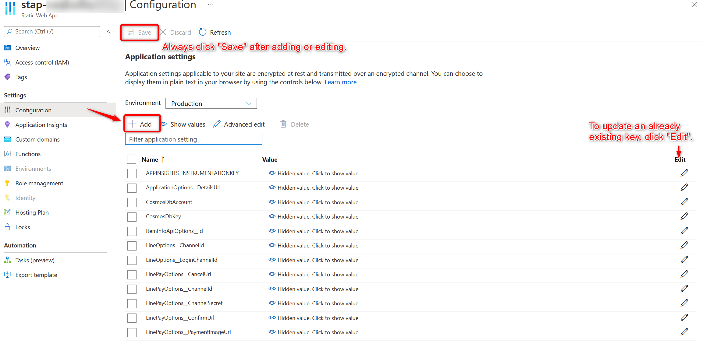
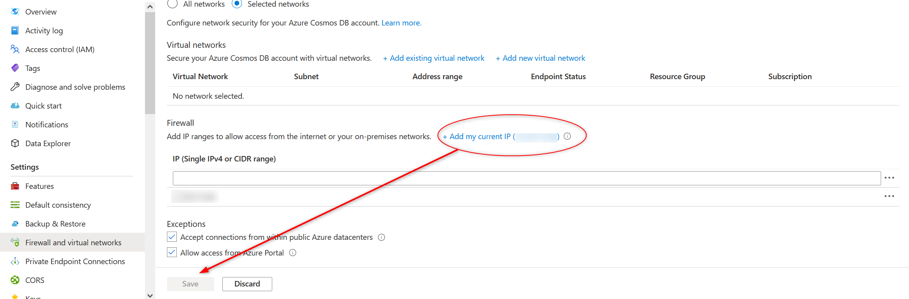
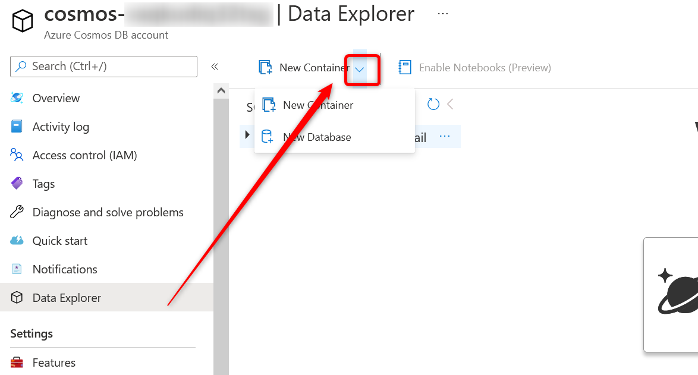
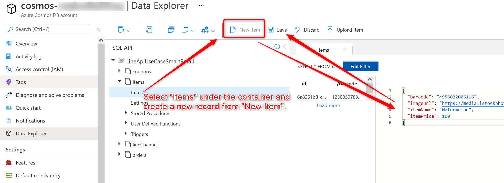
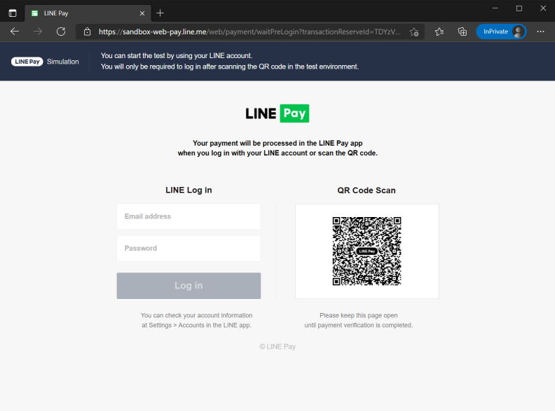
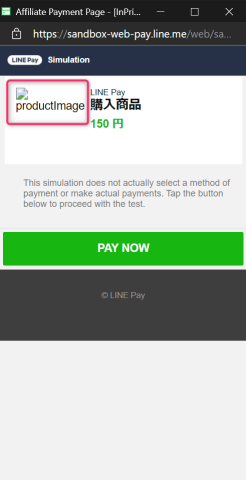
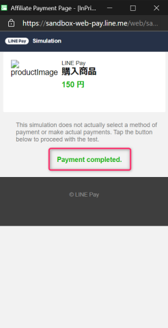

## Configure the backend deployed to Azure and submit the initial data
## Add environment variables
Add the following values to the application settings (from the Azure portal, open the "Configuration" of the deployed Static Web Apps)

| key | val |
| --- | --- |
| LineOptions__ChannelId | Channel ID of the Messaging API channel |
| LineOptions__LoginChannelId | Channel ID of the LINE login channel |
| LinePayOptions__ChannelId | Channel ID for LINE Pay |
| LinePayOptions__ChannelSecret | Channel Secret for LINE Pay |



After entering the information, press "Save" to save the file.

## Register master data to Cosmos DB
- From the Azure portal, open the firewall and virtual network settings of the deployed Cosmos DB and add the IP address of the work source

- Open the data explorer and do the work
    - From the Azure portal, access the deployed Cosmos DB to view it
    - https://docs.microsoft.com/en-us/azure/cosmos-db/data-explorer
- Create DB
    - Create a Database with Database id `LineApiUseCaseSmartRetail`.
    　　
- Container creation and data addition
    1. create coupons, items and lineChannel containers with container name and PK as described below.
    1. add the data described below to the coupons and items containers
    1. add the data filled with the template described below to the lineChannel container
    1. add data to lineChannel container
    

### 1. container information

| container name | pk |
| --- | --- |
| coupons | /couponId |
| items | /barcode |
| lineChannel | /channelId |

### Data to be added to coupons and items

coupons

```json
{
  "barcode": "4956022006116",
  "couponDescription": "[Appreciation price] 20% discount on watermelon",
  "couponId": "watermelon_coupon",
  "deleted": "",
  "discountEndDatetime": "2022-12-31 23:59:000",
  "discountRate": 20,
  "discountStartDatetime": "2021-04-01 00:00:000",
  "discountWay": 2,
  "imageUrl": "https://media.istockphoto.com/vectors/watermelon-icon-in-trendy-flat-style-isolated-on-white-background-vector-id877064160?s=612x612",
  "itemName": "Watermelon",
  "remarks": "For each watermelon, you will receive a 20 yen discount."
}
````


items

```json
{
  "barcode": "4956022006116",
  "imageUrl": "https://media.istockphoto.com/vectors/watermelon-icon-in-trendy-flat-style-isolated-on-white-background-vector-id 877064160?s=612x612",
  "itemName": "Watermelon",
  "itemPrice": 100
}
```

```json
{
  "barcode": "1230059783947",
  "imageUrl": "https://media.gettyimages.com/vectors/stack-of-books-vector-id504374218?s=2048x2048",
  "itemName": "Book",
  "itemPrice": 100
}
```

```json
{
  "barcode": "2130627341496",
  "imageUrl": "https://media.gettyimages.com/vectors/tomato-flat-design-vegetable-icon-vector-id1017915086?s=2048x2048",
  "itemName": "Tomato",
  "itemPrice": 50
}
```

```json
{
  "barcode": "8358328475935",
  "imageUrl": "https://media.gettyimages.com/vectors/stack-of-books-vector-id504374218?s=2048x2048",
  "itemName": "Book",
  "itemPrice": 100
}
```

```json
{
  "barcode": "84895769",
  "imageUrl": "https://media.istockphoto.com/vectors/simple-apple-in-flat-style-vector-illustration-vector-id1141529240?s=612x612",
  "itemName": "apple",
  "itemPrice": 50
}
```

### Template for the data to be added to the lineChannel.

```json
{
    "channelId": "The channel ID of the Messaging API channel",
    "channelSecret": "The channel secret of the Messaging API channel",
    "channelAccessToken": "The channel token of the Messaging API channel",
    "limitDate": "2021-01-01T00:00:00.0000000+00:00",
    "updatedTime": "2021-01-01T00:00:00.0000000+00:00"
}
```

# Backend Local Execution Procedure
## Environment
- NET Core 3.1 SDK
    - NET Core 3.1 SDK https://dotnet.microsoft.com/download/dotnet/3.1
- Visual Studio Code
    - NET Core 3.1 SDK https://code.visualstudio.com
- Azure Functions for Visual Studio Code
    - https://marketplace.visualstudio.com/items?itemName=ms-azuretools.vscode-azurefunctions
- Cosmos DB Emulator
    - https://docs.microsoft.com/en-us/azure/cosmos-db/local-emulator
    - (for mac, linux) https://docs.microsoft.com/en-us/azure/cosmos-db/linux-emulator

## Preliminaries
### Prepare local.settings.json
- Items required when testing LINE Pay payments
    - LINE Channel ID
    - LINE Login Channel ID
    - LINE Pay Channel ID and Secret
    - (When connecting from the front-end to check operation) Various URLs
        - The ones at `http://localhost/~` are applicable
    - `CosmosDbAccount` Cosmos DB account URL (if you are using CosmosDB emulator locally, you can leave it in the template file)
    - `CosmosDbKey` Cosmos DB key (if you use CosmosDB emulator locally, you can leave the template file as it is)

#### template

```json
{
  "IsEncrypted": false,
  "Values": {
    "AzureWebJobsStorage": "UseDevelopmentStorage=true",
    "FUNCTIONS_WORKER_RUNTIME": "dotnet",
    "ApplicationOptions__DetailsUrl": "http://localhost/history.html",
    "LineOptions__ChannelId": "<LINE_CHANNEL_ID>",
    "LineOptions__LoginChannelId": "<LINE_LOGIN_CHANNEL_ID>",
    "LinePayOptions__ChannelId": "<LINEPAY_CHANNEL_ID>",
    "LinePayOptions__ChannelSecret": "<LINEPAY_CHANNEL_SECRET>",
    "LinePayOptions__PaymentImageUrl": "http://localhost/dummy",
    "LinePayOptions__ConfirmUrl": "http://localhost/completed.html",
    "LinePayOptions__CancelUrl": "http://localhost/smaphregi/",
    "CosmosDbAccount": "https://localhost:8081/",
    "CosmosDbKey": "C2y6yDjf5/R+ob0N8A7Cgv30VRDJIWEHLM+4QDU5DE2nQ9nDuVTqobD4b8mGGyPMbIZnqyMsEcaGQy67XIw/Jw=="
  }
}
```

### Preparing Cosmos DB (master registration)
Create the database, container, and master data in the same way as you did for the Azure resource.

### Flow to execute payment with API only.
1. create order data with `/put_cart_data`
1. get the payment URL (info.paymentUrl) and transaction ID (info.transactionId) with `/put_linepay_request`.
1. access the payment URL from your browser, login with your LINE account and execute the payment.
After completion, execute `/put_linepay_confirm`.

### Operation when accessing the payment URL (LINE Pay sandbox payment)
Access the payment URL and login with your LINE account.  


A pop-up window will open, wait until the productImage (or images if set correctly) appears, and then press the "PAY NOW" button  


You should see a message saying, "Payment completed". After confirming that the message is displayed, execute `/put_linepay_confirm`.  



[Go to the next page](frontend-deployment.md)

[Back to Table of Contents](./README_en.md)
