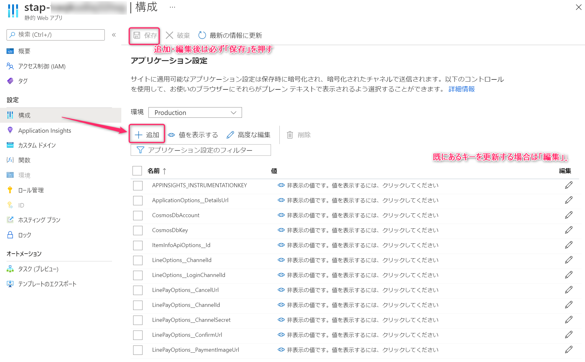
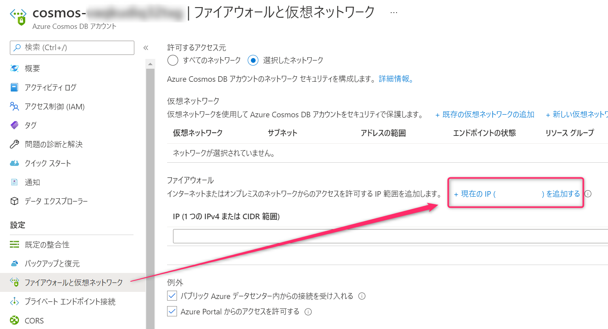
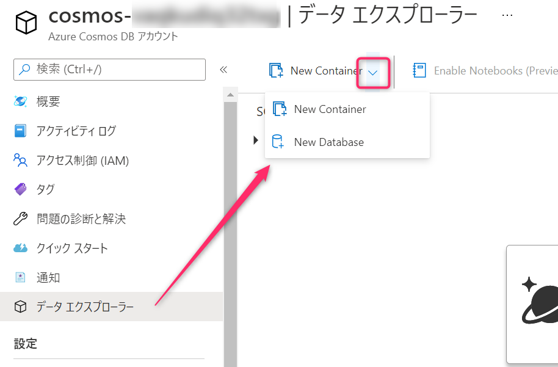
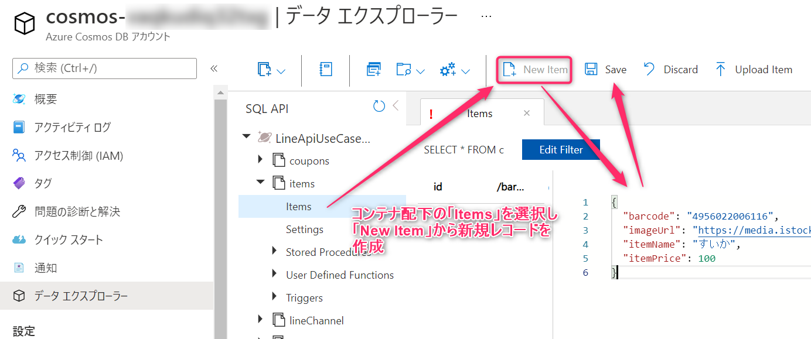
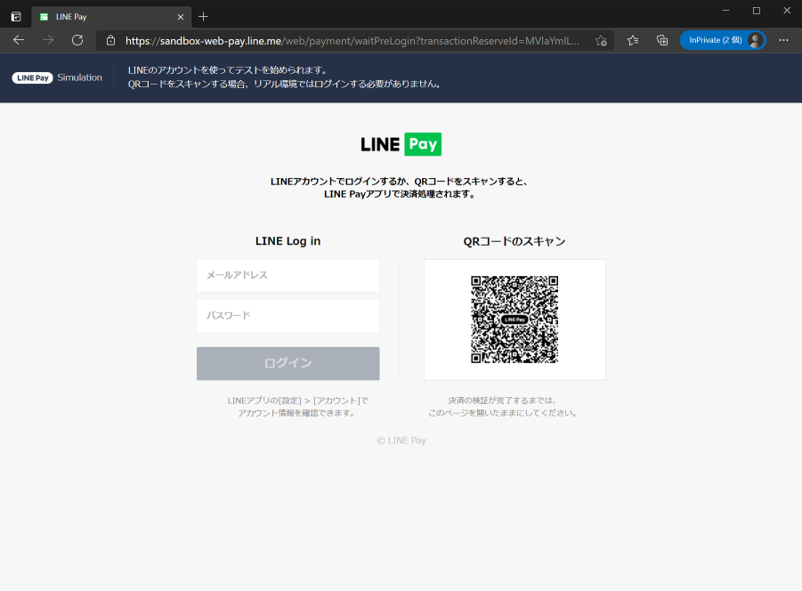
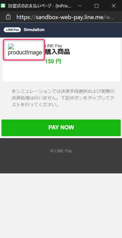
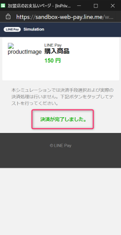

# Azureへデプロイしたバックエンドの設定と初期データの投入
## 環境変数の追加
アプリケーション設定に以下の値を追加する（Azureポータルから、デプロイしたStatic Web Appsの「構成」を開く）

| key | val |
| --- | --- |
| LineOptions__ChannelId | Messaging APIチャネルのチャネルID |
| LineOptions__LoginChannelId | LINEログインチャネルのチャネルID |
| LinePayOptions__ChannelId | LINE PayのチャネルID |
| LinePayOptions__ChannelSecret | LINE Payのチャネルシークレット |



入力したら「保存」を押して保存します。

## Cosmos DBへマスタデータ登録
- Azureポータルから、デプロイしたCosmos DBのファイアウォール設定を開き、作業元のIPアドレスを追加する

- データエクスプローラーを開き、作業を行う
    - Azureポータルから、デプロイしたCosmos DBへアクセスすることで閲覧可能
    - https://docs.microsoft.com/ja-jp/azure/cosmos-db/data-explorer
- DB作成
    - Database id `LineApiUseCaseSmartRetail` でDatabaseを作成
    　　
- コンテナ作成・データ追加
    1. 後述のコンテナ名・PKでcoupons, items, lineChannelコンテナを作成
    1. coupons, itemsコンテナに後述データを追加
    1. lineChannelコンテナに後述テンプレートを埋めたデータを追加
    

### 1. コンテナ情報

| コンテナ名 | pk |
| --- | --- |
| coupons | /couponId |
| items | /barcode |
| lineChannel | /channelId |

### 2. coupons, itemsに追加するデータ

coupons

```json
{
  "barcode": "4956022006116",
  "couponDescription": "【感謝価格】すいか20%割引",
  "couponId": "watermelon_coupon",
  "deleted": "",
  "discountEndDatetime": "2022-12-31 23:59:000",
  "discountRate": 20,
  "discountStartDatetime": "2021-04-01 00:00:000",
  "discountWay": 2,
  "imageUrl": "https://media.istockphoto.com/vectors/watermelon-icon-in-trendy-flat-style-isolated-on-white-background-vector-id877064160?s=612x612",
  "itemName": "すいか",
  "remarks": "すいか１点につき、20円引きとなります。"
}
```


items

```json
{
  "barcode": "4956022006116",
  "imageUrl": "https://media.istockphoto.com/vectors/watermelon-icon-in-trendy-flat-style-isolated-on-white-background-vector-id877064160?s=612x612",
  "itemName": "すいか",
  "itemPrice": 100
}
```

```json
{
  "barcode": "1230059783947",
  "imageUrl": "https://media.gettyimages.com/vectors/stack-of-books-vector-id504374218?s=2048x2048",
  "itemName": "書籍",
  "itemPrice": 100
}
```

```json
{
  "barcode": "2130627341496",
  "imageUrl": "https://media.gettyimages.com/vectors/tomato-flat-design-vegetable-icon-vector-id1017915086?s=2048x2048",
  "itemName": "とまと",
  "itemPrice": 50
}
```

```json
{
  "barcode": "8358328475935",
  "imageUrl": "https://media.gettyimages.com/vectors/stack-of-books-vector-id504374218?s=2048x2048",
  "itemName": "書籍",
  "itemPrice": 100
}
```

```json
{
  "barcode": "84895769",
  "imageUrl": "https://media.istockphoto.com/vectors/simple-apple-in-flat-style-vector-illustration-vector-id1141529240?s=612x612",
  "itemName": "りんご",
  "itemPrice": 50
}
```

### 3. lineChannelに追加するデータのテンプレート

```json
{
    "channelId": "Messaging APIチャネルのチャネルID",
    "channelSecret": "Messaging APIチャネルのチャネルシークレット",
    "channelAccessToken": "Messaging APIチャネルのチャネルトークン",
    "limitDate": "2021-01-01T00:00:00.0000000+00:00",
    "updatedTime": "2021-01-01T00:00:00.0000000+00:00"
}
```

# バックエンド ローカル実行手順
## 環境
- .NET Core 3.1 SDK
    - https://dotnet.microsoft.com/download/dotnet/3.1
- Visual Studio Code
    - https://code.visualstudio.com
- Azure Functions for Visual Studio Code
    - https://marketplace.visualstudio.com/items?itemName=ms-azuretools.vscode-azurefunctions
- Cosmos DB Emulator
    - https://docs.microsoft.com/ja-jp/azure/cosmos-db/local-emulator
    - (for mac, linux) https://docs.microsoft.com/en-us/azure/cosmos-db/linux-emulator

## 前準備
### local.settings.jsonの用意
- LINE Payの決済をテストする場合に必要な項目
    - LINEチャネルID
    - LINEログインのチャネルID
    - LINE PayのチャネルID、シークレット
    - (フロントエンドから接続して動作確認する場合)各種URL
        - `http://localhost/~` のものが該当
    - `CosmosDbAccount` Cosmos DBのアカウントURL(ローカルでCosmosDBエミュレータを使う場合はテンプレートファイルのままでOK)
    - `CosmosDbKey` Cosmos DBのキー(ローカルでCosmosDBエミュレータを使う場合はテンプレートファイルのままでOK)

#### テンプレート

```json
{
  "IsEncrypted": false,
  "Values": {
    "AzureWebJobsStorage": "UseDevelopmentStorage=true",
    "FUNCTIONS_WORKER_RUNTIME": "dotnet",
    "ApplicationOptions__DetailsUrl": "http://localhost/history.html",
    "LineOptions__ChannelId": "<LINE_CHANNEL_ID>",
    "LineOptions__LoginChannelId": "<LINE_LOGIN_CHANNEL_ID>",
    "LinePayOptions__ChannelId": "<LINEPAY_CHANNEL_ID>",
    "LinePayOptions__ChannelSecret": "<LINEPAY_CHANNEL_SECRET>",
    "LinePayOptions__PaymentImageUrl": "http://localhost/dummy",
    "LinePayOptions__ConfirmUrl": "http://localhost/completed.html",
    "LinePayOptions__CancelUrl": "http://localhost/smaphregi/",
    "CosmosDbAccount": "https://localhost:8081/",
    "CosmosDbKey": "C2y6yDjf5/R+ob0N8A7Cgv30VRDJIWEHLM+4QDU5DE2nQ9nDuVTqobD4b8mGGyPMbIZnqyMsEcaGQy67XIw/Jw=="
  }
}
```

### Cosmos DBの用意（マスタ登録）
Azureリソースに対して行ったものと同様の手順でデータベース、コンテナ、マスタデータを作成する

## APIのみで決済までを実行する流れ
1. `/put_cart_data` で注文データを作成
1. `/put_linepay_request` で決済URL(info.paymentUrl)とトランザクションID(info.transactionId)を取得
1. ブラウザから決済URLへアクセスし、LINEアカウントでログイン後に決済を実行
1. 完了後、 `/put_linepay_confirm` を実行

### 決済URLアクセス時の操作（LINE Pay sandboxでの決済）
決済URLにアクセスし、個人のLINEアカウントでログイン  


ポップアップウインドウが開かれるので、productImage（正しく設定した場合は画像）が出るまで待ってから、「PAY NOW」ボタンを押下  


「決済が完了しました。」メッセージが表示されたことを確認後、 `/put_linepay_confirm` を実行  



[次の頁へ](frontend-deployment.md)

[目次へ戻る](../../README.md)
