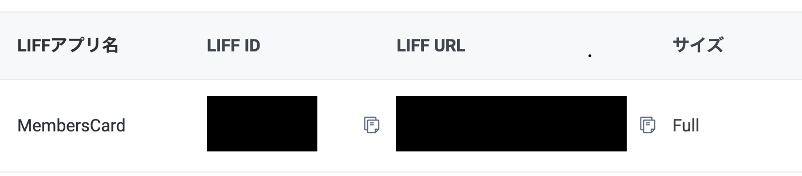

# Azureへデプロイしたフロントエンドの設定
デプロイはパイプラインで実行されるので特に作業はありません

# 開発環境 / ローカル開発環境
## IDE
お好みのもので構いませんが、特にこだわりがなければVSCodeをお勧めします。

Visual Studio Code  
https://code.visualstudio.com

## PHP, http-server
ローカルサーバーを立てるのに使用します。  

http-server  
https://www.npmjs.com/package/http-server

## ngrok
ローカルのLIFFアプリを表示するためにngrokを使用します。
ngrokのインストール  
https://ngrok.com/download

## node インストール
JavaScriot環境を構築するため、nodeを準備する  
https://nodejs.org/en/download/　よりLTS版をインストール

## node パッケージをインストール
1. コマンドライン（Terminalなど）で[frontendフォルダ](../../frontend/)に移動する
1. `npm install` する。
1. [frontendフォルダ](../../frontend/)に `node_modules` というディレクトリが作成される

## ngrokを使ってローカル実行
  - [.env](../../frontend/.env)の環境変数を適切な値に変更
    - `BASE_URL` をStatic Web AppsのURLに変更する
    - `LIFF_ID` の値はLINE公式アカウントからliffIdを取得し変更する
  - [frontendフォルダ](../../frontend/)直下に移動し、ローカルサーバーをたてる
    - `php -S localhost:5000` or `http-server -p 5000`  など
  - [ngrok](https://ngrok.com/) を使って公開サーバーのURLを発行
      - `ngrok http 5000`
        - LIFFアプリのエンドポイントURLをngrokが発行したURLに設定
  - functionsを起動後、LIFF URLに遷移する 

[次の頁へ](validation.md)

[目次へ戻る](../../README.md)
